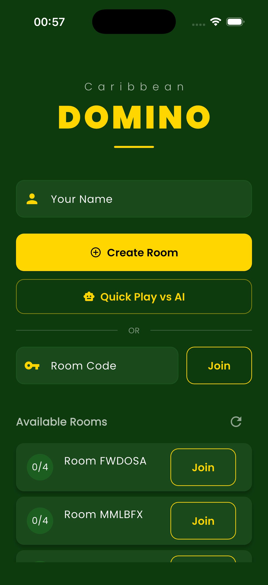
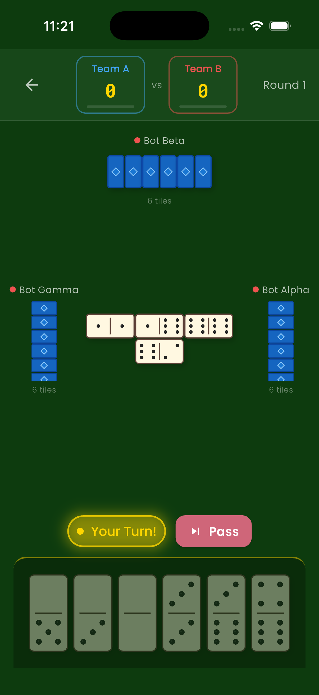

# Caribbean Domino Game - Real-time Multiplayer API

A serverless backend for a Caribbean-style domino game supporting 4-player team matches (2v2). Built with Vercel Serverless Functions and Supabase for real-time state synchronization.

## Screenshots

<p align="center">
  
  
</p>

| Lobby | Gameplay |
|:---:|:---:|
| Room creation, join by code, available rooms list | Team scores, board state, turn management, bot opponents |

## Tech Stack

- **Runtime**: Vercel Serverless Functions (Node.js)
- **Database**: Supabase (PostgreSQL)
- **Realtime**: Supabase Realtime (subscriptions on `game_states` and `moves` tables)
- **Language**: TypeScript

## Setup

### 1. Environment Variables

Copy `.env.example` to `.env.local` and fill in your Supabase credentials:

```bash
cp .env.example .env.local
```

### 2. Database Migration

Run the SQL migration in your Supabase project dashboard (SQL Editor) or via the Supabase CLI:

```bash
supabase db push
```

The migration file is at `supabase/migrations/001_initial.sql`.

### 3. Install Dependencies

```bash
npm install
```

### 4. Local Development

```bash
npm run dev
```

### 5. Deploy

```bash
npm run deploy
```

### 6. Run Tests

```bash
npm test
```

## API Endpoints

| Method | Endpoint | Description |
|--------|----------|-------------|
| GET | `/api/health` | Health check |
| POST | `/api/rooms/create` | Create a new game room |
| POST | `/api/rooms/join` | Join a room by code |
| GET | `/api/rooms/list` | List available (waiting) rooms |
| GET | `/api/rooms/[id]` | Get room details with player list |
| POST | `/api/game/start` | Start the game (requires 4 players) |
| POST | `/api/game/place-tile` | Place a tile on the board |
| POST | `/api/game/pass` | Pass your turn (only if no valid moves) |
| GET | `/api/game/state` | Get current game state (sanitized per player) |
| POST | `/api/game/add-bots` | Fill empty seats with AI bot players |

## Game Rules (Caribbean Dominoes)

- 4 players in 2 teams (seats 0,2 vs seats 1,3)
- Standard double-six set (28 tiles), 7 dealt to each player
- Player with the highest double starts
- Play proceeds clockwise
- A player must play if able, otherwise passes
- Round ends when a player empties their hand or all players are blocked
- Losing team's remaining pips are awarded to the winning team
- First team to reach the target score (default 100) wins

## Realtime Sync

The Flutter client subscribes to Supabase Realtime channels on the `game_states` and `moves` tables. When any player places a tile or passes, the game state row is updated, and all connected clients receive the change instantly via WebSocket.

```dart
supabase
  .from('game_states')
  .stream(primaryKey: ['room_id'])
  .eq('room_id', roomId)
  .listen((data) {
    // Update local game state
  });
```
